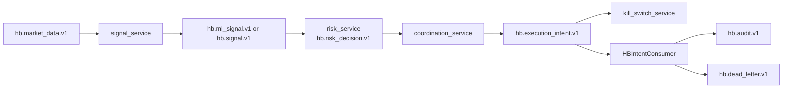

# Data Flow: Signal -> Risk -> Execution

## Purpose

Detail event lifecycle and decision propagation across the signal pipeline,
the bridge-level routing into controllers, and the HARD_STOP safety path.

## High-Level Flow



## Bridge-Level Signal Routing (P0-1)

The `hb_bridge.py` `drive_desk_tick()` function polls `hb.signal.v1` every tick
and routes signals directly into controller methods — no code changes needed
in `epp_v2_4.py`.

```
signal_service                hb_bridge                    epp_v2_4 controller
    |                             |                              |
    |-- xadd(hb.signal.v1) ----> |                              |
    |                             |-- xread(hb.signal.v1) -----> |
    |                             |   (non-blocking, block=0)    |
    |                             |                              |
    |                             |  signal_name == "inventory_rebalance"
    |                             |  match by instance_name      |
    |                             |                              |
    |                             |-- apply_execution_intent --> |
    |                             |   action=set_target_base_pct |
    |                             |                              |
    |                             |                  sets _external_target_base_pct_override
    |                             |                  (used in next _resolve_regime_and_targets)
```

**Key design constraints:**
- Redis I/O stays in `hb_bridge.py` — controller has no Redis imports.
- `_consume_signals()` is wrapped in `try/except` — Redis down never crashes the tick.
- Only `inventory_rebalance` signals are processed; ML signals are reserved for future use.
- `_last_signal_id` tracks stream cursor; on restart, all historical signals replay (last value wins).

## HARD_STOP → Kill Switch Path (P0-2)

When a controller enters `HARD_STOP`, the bridge detects the first transition
and publishes a kill-switch intent to cancel all open exchange orders.

```
epp_v2_4 controller          hb_bridge                    kill_switch_service
    |                             |                              |
    | _ops_guard.state            |                              |
    |   changes to HARD_STOP      |                              |
    |                             |                              |
    |                  _check_hard_stop_transitions()             |
    |                  compares prev vs current guard state       |
    |                             |                              |
    |            (first transition only)                          |
    |                             |                              |
    |                             |-- xadd(hb.execution_intent.v1)
    |                             |   action=kill_switch    ---> |
    |                             |                              |
    |                             |                  cancels all exchange orders
    |                             |                  writes reports/kill_switch/latest.json
```

**Key design constraints:**
- Only fires on the **first** HARD_STOP transition (not every tick).
- Previous guard state tracked per controller in `_prev_guard_states` dict.
- `epp_v2_4.py` and `ops_guard.py` are not modified.

## Sequencing Rules

- Every derived event sets `correlation_id` = upstream `event_id`.
- Risk decisions must include explicit reason codes.
- Intents must include expiry (`expires_at_ms`).

## Local Enforcement

- HB validates connector readiness and intent bounds before applying.
- `apply_execution_intent()` validates `target_base_pct` range [0, 1] and returns `(ok, reason)`.
- Rejections are auditable via the returned reason string.

## Failure Modes

- Stream lag → stale signal rejection (risk_service `ml_stale_signal`).
- Intent expiry → dead-letter.
- Redis outage → bridge logs warning, tick continues with last-known state.
- Signal with unknown `instance_name` → silently skipped (logged at debug).

## Owner

- Engineering/Platform
- Last-updated: 2026-02-26

