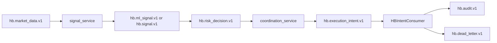

# Data Flow: Signal -> Risk -> Execution

## Purpose
Detail event lifecycle and decision propagation.

## Flow

## Sequencing Rules
- Every derived event sets `correlation_id` = upstream `event_id`.
- Risk decisions must include explicit reason codes.
- Intents must include expiry (`expires_at_ms`).

## Local Enforcement
- HB validates connector readiness and intent bounds before applying.
- Rejections are auditable.

## Failure Modes
- Stream lag -> stale signal rejection.
- Intent expiry -> dead-letter.
- Bus outage -> external-intent soft-pause path.

## Owner
- Engineering/Platform
- Last-updated: 2026-02-19

