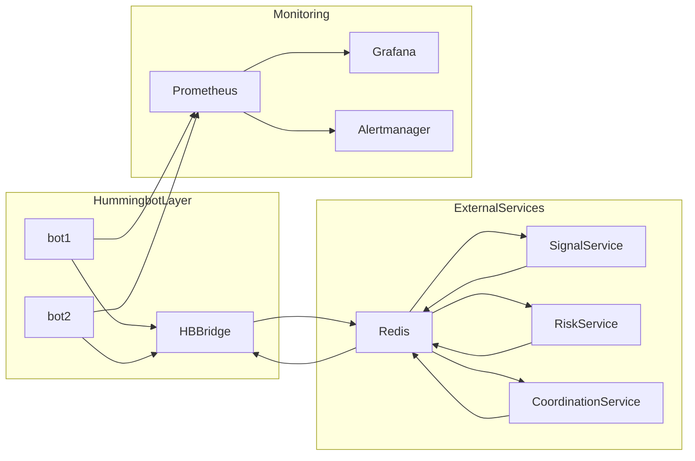

# System Architecture

## Purpose
Provide the high-level architecture for trading, orchestration, and monitoring.

## Scope
Containerized runtime and inter-service data/control paths.

## Diagram

## Key Principles
- Hummingbot remains execution gateway and final local safety.
- External services coordinate signal/risk independently.
- Monitoring separated from trading control plane.

## Owner
- Architecture/Platform
- Last-updated: 2026-02-19

