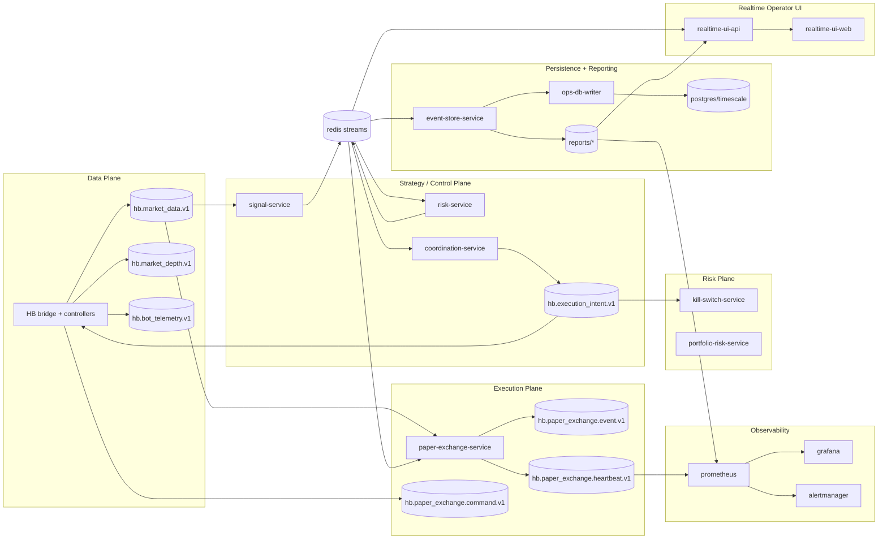

# System Architecture

## Purpose
Define the canonical runtime architecture for the EPP v2.4 desk across data,
strategy/control, execution, risk, persistence, and observability planes.

## Scope
Containerized production topology (`infra/compose/docker-compose.yml`) and stream-based
service contracts (`services/contracts/*`).

## Domain Boundaries
- **Data plane**: market snapshots and telemetry events.
- **Strategy/control plane**: signal/risk/coordination decisions and intent routing.
- **Execution plane**: paper exchange service command/event lifecycle.
- **Risk planes**:
  - bot-level guardrails (`ops_guard`, kill-switch path),
  - portfolio-level controls (`portfolio-risk-service`, policy gates).
- **Persistence/observability plane**: event store, ops DB writer, release artifacts, dashboards, alerts.

## Strategy Isolation
- Shared runtime modules must remain strategy-agnostic and must not import lane modules.
- Bot-specific strategy logic must be isolated under `controllers/bots/`.
- `controllers/market_making/` is reserved for market-making loader shims only.
- Legacy `epp_v2_4_bot*` files are compatibility wrappers only.
- See `docs/architecture/strategy_isolation_contract.md` for dependency rules and verification commands.

## Runtime Kernel
- Neutral kernel modules now live under `controllers/runtime/`:
  - `contracts.py`
  - `core.py`
  - `data_context.py`
  - `risk_context.py`
  - `execution_context.py`
- Explicit family adapters now live under `controllers/runtime/`:
  - `market_making_core.py`
  - `directional_core.py`
- Current migration rule:
  - keep external v1 streams and artifact namespaces stable
  - allow additive metadata such as `controller_contract_version` and `runtime_impl`
  - treat `shared_mm_v24` as the market-making implementation behind the neutral runtime hooks while bot5/bot6/bot7 use the directional family adapter

## Runtime Diagram

```mermaid
flowchart LR
  subgraph DataPlane[Data Plane]
    hb[HB bridge + controllers]
    md[(hb.market_data.v1)]
    depth[(hb.market_depth.v1)]
    bt[(hb.bot_telemetry.v1)]
  end

  subgraph ControlPlane[Strategy / Control Plane]
    sig[signal-service]
    risk[risk-service]
    coord[coordination-service]
    intent[(hb.execution_intent.v1)]
  end

  subgraph ExecPlane[Execution Plane]
    pe[paper-exchange-service]
    pec[(hb.paper_exchange.command.v1)]
    pee[(hb.paper_exchange.event.v1)]
    peh[(hb.paper_exchange.heartbeat.v1)]
  end

  subgraph RiskPlane[Risk Plane]
    ks[kill-switch-service]
    pr[portfolio-risk-service]
  end

  subgraph Persistence[Persistence + Reporting]
    es[event-store-service]
    dbw[ops-db-writer]
    pg[(postgres/timescale)]
    rep[(reports/*)]
  end

  subgraph Observability[Observability]
    prom[prometheus]
    graf[grafana]
    am[alertmanager]
  end

  subgraph RealtimeUi[Realtime Operator UI]
    rapi[realtime-ui-api]
    rweb[realtime-ui-web]
  end

  redis[(redis streams)]

  hb --> md
  hb --> depth
  hb --> bt
  md --> sig --> redis
  redis --> risk --> redis
  redis --> coord --> intent
  intent --> hb
  intent --> ks

  hb --> pec
  md --> pe
  redis --> pe
  pe --> pee
  pe --> peh

  redis --> es
  redis --> rapi
  es --> rep
  es --> dbw --> pg
  rep --> rapi
  rapi --> rweb

  rep --> prom --> graf
  prom --> am
  peh --> prom
```

## Source Of Truth By Plane
- **Order lifecycle (paper mode)**: `paper-exchange-service` state + journals.
- **Trading decisions**: controller + risk/coordination intent chain.
- **Event history**: `event-store-service` artifacts, mirrored to DB when enabled.
- **Realtime operator view**: `realtime-ui-api` stream-first read model with desk-snapshot fallback.
- **Promotion go/no-go**: `scripts/release/run_promotion_gates.py` + `run_strict_promotion_cycle.py`.

## Hummingbot Framework Boundary

Hummingbot is the framework shell, not the owner of the execution-critical decision loop.

### What stays in Hummingbot
- connector integrations, exchange rules, account lifecycle, trading-rule queries
- outer strategy/runtime lifecycle (`StrategyV2Base`, `MarketMakingControllerBase`)
- executor actions (`CreateExecutorAction`, `StopExecutorAction`)
- event types used for translation only (`OrderFilledEvent`, `OrderCancelledEvent`, `MarketOrderFailureEvent`)
- candle/market-data-provider configuration (`CandlesConfig`)

### What runs in the local desk hot path (no Hummingbot dependency)
- canonical market-data view used for same-tick decisions
- strategy decision logic and per-tick state (`shared_mm_v24.py` logic, `risk_evaluator.py`)
- inline hard-risk vetoes (`risk_evaluator.py` — zero HB imports)
- execution routing and venue-facing order path
- PaperDesk in-process venue (`controllers/paper_engine_v2/desk.py`)

### What stays async in services
- Redis Streams fan-out and replay
- event mirroring, event store, ops DB persistence
- realtime UI/read models
- portfolio analytics, release gates, supervisory automation
- paper-exchange-service (async journal/mirror only — see below)

### Hot-path file import classification

| File | HB imports | Classification |
|------|-----------|---------------|
| `scripts/shared/v2_with_controllers.py` | 21 (10 module-level, 11 lazy) | **keep all** — this IS the framework shell |
| `controllers/shared_mm_v24.py` | 6 (3 module-level, 3 lazy) | **keep all** — controller base class + event types |
| `controllers/risk_evaluator.py` | 0 | **clean** — fully local, no HB dependency |
| `controllers/paper_engine_v2/hb_bridge.py` | 3 (all lazy) | **keep 1, isolate 2** — PriceType is keep; MarketDataProvider and ExecutorBase patches are isolate candidates |
| `controllers/paper_engine_v2/hb_event_fire.py` | 5 (all lazy) | **keep all** — event translation is this file's purpose |
| `controllers/paper_engine_v2/data_feeds.py` | 1 (lazy) | **keep** — PriceType for price queries |

Isolate candidates (future tick-path removal):
- `MarketDataProvider` monkey-patch in `hb_bridge.py` — patching HB internals for fallback behavior
- `ExecutorBase` monkey-patch in `hb_bridge.py` — patching HB executor behavior

### Paper-engine HB boundary

The documented boundary says `hb_bridge.py` is "THE ONLY FILE in paper_engine_v2 that imports Hummingbot types." In practice, three files import HB types:
- `hb_bridge.py` (3 lazy imports)
- `hb_event_fire.py` (5 lazy imports — extracted from the bridge)
- `data_feeds.py` (1 lazy import)

All three are bridge-adjacent translation layers. The boundary is architecturally sound but slightly wider than documented. New paper-engine files must not add HB imports; translation must stay in these three files.

### Paper exchange service classification

`services/paper_exchange_service/` has zero HB imports. It is a standalone Redis-stream-driven service with its own state and matching logic, completely independent of PaperDesk.

Target classification: **async-only**. The paper-exchange-service container becomes a journal writer and async mirror. PaperDesk in-process (via `hb_bridge.py`) is the execution venue on the hot path.

Current gap: paper-exchange-service has synchronous file I/O on its order path (`_write_json_atomic`, `_persist_command_journal`, `_persist_state_snapshot`). This must move to async or become non-blocking before the service can safely run alongside the hot path without jitter risk.

## Risk Check Classification

Risk checks are split between the inline hot path and supervisory governance. This boundary is already correct in the current codebase.

### Inline hard vetoes (on the hot path, in `risk_evaluator.py`)

All checks are deterministic, cheap Decimal comparisons with zero external IO and zero HB imports.

| Check | Reason | Outcome |
|-------|--------|---------|
| Inventory below min | `base_pct_below_min` | soft pause |
| Inventory above max | `base_pct_above_max` | soft pause |
| Notional above cap | `projected_total_quote_above_cap` | soft pause |
| Daily turnover exceeded | `daily_turnover_hard_limit` | HARD STOP |
| Daily loss exceeded | `daily_loss_hard_limit` | HARD STOP |
| Drawdown exceeded | `drawdown_hard_limit` | HARD STOP |
| Margin ratio critical (perp) | `margin_ratio_critical` | HARD STOP |
| Margin ratio warning (perp) | `margin_ratio_warning` | soft pause |
| Startup sync not done | `startup_position_sync_pending` | soft pause |
| Position drift high | `position_drift_high` | soft pause |
| Order book stale | `order_book_stale` | soft pause |
| End-of-day close pending | `eod_close_pending` | soft pause |
| Edge gate hysteresis | edge_gate_blocked | soft pause (stateful, cheap) |

### Supervisory governance (after the order decision path)

All governance runs in `_run_supervisory_maintenance()` (controller) and the supervisory block in `v2_with_controllers.py`. These may do IO, Redis reads, or periodic API calls.

| Check | Method | Owner | Notes |
|-------|--------|-------|-------|
| Fee config refresh | `_ensure_fee_config()` | controller | API/profile IO, rate-limited |
| Funding rate refresh | `_refresh_funding_rate()` | controller | exchange API IO, rate-limited |
| Portfolio risk guard | `_check_portfolio_risk_guard()` | controller | Redis IO, latches HARD STOP for next tick |
| Position reconciliation | `_check_position_reconciliation()` | controller | connector IO, auto-correction |
| Manual kill switch | `check_manual_kill_switch()` | strategy | HB base strategy |
| Max drawdown control | `control_max_drawdown()` | strategy | HB base strategy |
| Performance report | `send_performance_report()` | strategy | pure reporting |
| Bus outage soft pause | `_handle_bus_outage_soft_pause()` | strategy | Redis health check |
| Kill switch service | `_check_hard_stop_kill_switch()` | strategy | service health check |

### Boundary status

The current boundary is correct: `risk_evaluator.py` contains only inline vetoes; governance is already in `_run_supervisory_maintenance()`. No refactoring is needed for Phase 5 of the low-latency migration. The key constraint going forward: never add IO, Redis calls, or slow computation to `risk_evaluator.py`.

## Shared Runtime Ownership
- `scripts/shared/v2_with_controllers.py` owns controller tick orchestration and operator-facing snapshot assembly only.
- Connector-owned open orders must be read via connector APIs, desk-owned paper orders via `_paper_desk_v2_bridges`, and service-owned runtime orders via `_paper_exchange_runtime_orders`.
- `controllers/paper_engine_v2/hb_bridge.py` owns translation between framework callbacks and paper-exchange command/event contracts; it must not become the canonical owner of operator snapshot shaping.
- `controllers/tick_emitter.py` remains the canonical owner of minute-snapshot field shaping for controller/runtime telemetry.

## Synchronous IO On The Hot Path (Phase 3 Audit)

The following blocking operations currently exist on the execution-critical path. Removing or deferring these is the goal of Phase 3 in the low-latency desk migration.

### Order submission path (`hb_bridge.py` `_patched_buy`/`_patched_sell`)

| Operation | Location | Impact |
|-----------|----------|--------|
| `r.xadd` (command publish) | `_publish_paper_exchange_command` | Redis round-trip per order |
| `JsonLatencyTracker.flush()` | `_publish_paper_exchange_command` | File write per command |
| `xrevrange` (heartbeat check) | `_paper_exchange_service_heartbeat_is_fresh` | Redis round-trip when mode=auto |

### `drive_desk_tick` path (`hb_bridge.py`)

| Operation | Location | Impact |
|-----------|----------|--------|
| `r.xread(block=1)` | `_consume_paper_exchange_events` | Up to 1 ms Redis block per tick |
| `r.xadd` | `_check_hard_stop_transitions`, `_ensure_sync_state_command` | Redis per transition/sync |
| `r.set` (cursor persist) | `_consume_paper_exchange_events` | Redis per tick |
| `json.load` from file | `_hydrate_runtime_orders_from_state_snapshot` | File read on sync_state |
| `desk.tick()` → `_state_store.save` | `desk.py` | File write, throttled ~30 s |
| `controller.did_fill_order` → `_csv.log_fill` | `shared_mm_v24.py` | File write per fill |
| `r.xadd` (telemetry) | `hb_event_fire.py` | Redis per fill event |
| `JsonLatencyTracker.flush()` | `drive_desk_tick` | File write per tick |
| `joblib.load` (adverse model) | `adverse_inference.py` | File read, first tick only |

### paper_exchange_service (already async-only, no hot-path dependency)

| Operation | Location | Impact |
|-----------|----------|--------|
| `_write_json_atomic` | `_persist_command_journal`, `_persist_state_snapshot`, `_persist_pair_snapshot` | File write every 250 ms–1 s when dirty |
| `r.xadd` | `process_command_rows`, `process_market_rows` | Redis per command/fill |
| `r.xreadgroup(block=1..10)` | Main loop | Blocking Redis read per tick |

### Cold-path-only subscribers (confirmed)

| Service | Type | Hot-path dependency |
|---------|------|---------------------|
| `event_store` | Redis stream consumer | None — hot path publishes to Redis, does not wait |
| `ops_db_writer` | File-based batch consumer | None — reads JSONL/CSV files, no Redis |

### Removal priorities (for Phase 3 implementation)

1. ~~**High**: `_csv.log_fill` in `did_fill_order`~~ — **DONE**. WAL keeps file handle open (1 op per fill vs 4). CSV flush + WAL truncation deferred to periodic `flush_all()`.
2. **High**: `JsonLatencyTracker.flush()` — already rate-limited to 5 s internally. Per-tick overhead is a cheap timestamp comparison. No further change needed.
3. **Medium**: `_hydrate_runtime_orders_from_state_snapshot` — file read on rare sync_state events. Low impact; defer if latency data shows concern.
4. ~~**Medium**: `_state_store.save` in `desk.tick()`~~ — **DONE**. Throttled saves (30 s) now run in a background thread. Forced saves (fills, startup) remain synchronous for crash-safety. `load()` and `clear()` join any pending thread automatically.
5. ~~**Low**: Redis `xadd` for telemetry in `_fire_hb_events`~~ — **DONE**. Payload built on calling thread; Redis xadd + file fallback deferred to daemon thread.
6. **Low**: Adverse model `joblib.load` — first tick only, acceptable startup cost.

## End-To-End Latency Budget

Full path from exchange WebSocket to order action, with instrumentation coverage.

### Current probes (strategy_hot_path_latest.json)

```
Exchange WS ──► HB connector event loop ──► on_tick() entry
                                             │
  tick_interval_ms ◄── time between ticks    │
                                             ▼
  paper_desk_tick_1_ms ◄─── PaperDesk tick (pre-controller)
  strategy_super_on_tick_ms ◄─── HB base on_tick()
    ├── controller_tick_ms ◄─── controller.on_tick() total
    │     ├── controller_preflight_hot_path_ms
    │     ├── controller_indicator_ms
    │     ├── controller_connector_io_ms (get_mid_price, balances)
    │     ├── controller_execution_plan_ms
    │     ├── controller_risk_eval_ms
    │     ├── controller_emit_tick_ms (executor actions)
    │     └── controller_governance_ms (supervisory maintenance)
    └── hb_framework_overhead_ms ◄─── super() minus controller time
  paper_desk_tick_2_ms ◄─── PaperDesk tick (post-controller)
    ├── bridge_consume_signals_ms
    ├── bridge_guard_state_ms
    ├── bridge_adverse_inference_ms
    ├── bridge_sync_state_ms
    ├── bridge_consume_pe_events_ms
    ├── bridge_desk_tick_only_ms ◄─── PaperDesk.tick() pure
    ├── hb_bridge_desk_tick_ms ◄─── bridge total
    └── bridge_fire_hb_events_ms
  bus_publish_market_state_ms ◄─── Redis xadd (async plane)
  bus_consume_execution_intents_ms ◄─── Redis xread (async plane)
  strategy_supervisory_ms ◄─── kill switch, drawdown, bus outage
  strategy_on_tick_total_ms ◄─── wall-clock tick total
  order_book_age_ms ◄─── book staleness at decision time
```

### Latency budget targets (Phase 6 exit criteria)

| Segment | Target p99 | Notes |
|---------|-----------|-------|
| tick_interval_ms | ~1000 ms (HB clock) | Jitter should be < 50 ms |
| hb_framework_overhead_ms | < 2 ms | HB executor/controller iteration |
| controller_tick_ms | < 5 ms | Strategy decision total |
| controller_risk_eval_ms | < 1 ms | Inline vetoes only |
| bridge_desk_tick_only_ms | < 1 ms | PaperDesk matching engine |
| hb_bridge_desk_tick_ms | < 3 ms | Full bridge cycle |
| bus_publish_market_state_ms | < 5 ms (current) → 0 ms (Phase 4) | Redis demoted to bg thread |
| bus_consume_execution_intents_ms | < 1000 ms (current) → 0 ms (Phase 4) | Redis demoted to bg thread |
| strategy_on_tick_total_ms | < 15 ms (current) → < 10 ms (Phase 4) | Full tick wall-clock |
| order_book_age_ms | < 2000 ms | Stale > threshold triggers soft pause |

### Segments not yet instrumented

| Segment | Why not | Plan |
|---------|---------|------|
| Exchange WS receive → HB connector internal processing | Inside HB framework; would require patching HB internals | Measure indirectly via tick_interval_ms jitter and order_book_age_ms |
| Order REST/WS submit → exchange ack | Exchange-side latency, outside our control | Measure via connector fill-event timestamp delta if available |

### How to read the report

The `JsonLatencyTracker` writes rolling p50/p95/p99 percentiles to `reports/verification/strategy_hot_path_latest.json` every 5 seconds. Key fields: each metric has `_p50`, `_p95`, `_p99` suffixes and a `_count` for the observation window.

When evaluating the architecture:
- If `hb_framework_overhead_ms` dominates, HB's internal loop is the bottleneck — further local optimization has diminishing returns.
- If `bus_publish_market_state_ms` or `bus_consume_execution_intents_ms` are high, Phase 4 (Redis demotion) is the priority.
- If `controller_tick_ms` is high, strategy logic complexity is the bottleneck.
- If `tick_interval_ms` shows high variance, HB's event loop is overloaded or GC is spiking.

## Failure Containment Policies
- Redis degradation must not crash controller ticks; bot remains in local safe mode.
- Missing/stale paper-exchange heartbeat is treated as critical once paper-exchange gates are enabled.
- Command processing is at-least-once; correctness relies on idempotency + pending reclaim.
- Promotion gates are fail-closed for critical checks (thresholds, preflight, canonical-plane guards).

## References
- `docs/techspec/service_interfaces.md`
- `docs/architecture/data_flow_signal_risk_execution.md`
- `docs/architecture/strategy_isolation_contract.md`
- `services/contracts/stream_names.py`
- `services/contracts/event_schemas.py`
- `infra/compose/docker-compose.yml`

## Owner
- Architecture/Platform
- Last-updated: 2026-03-11

