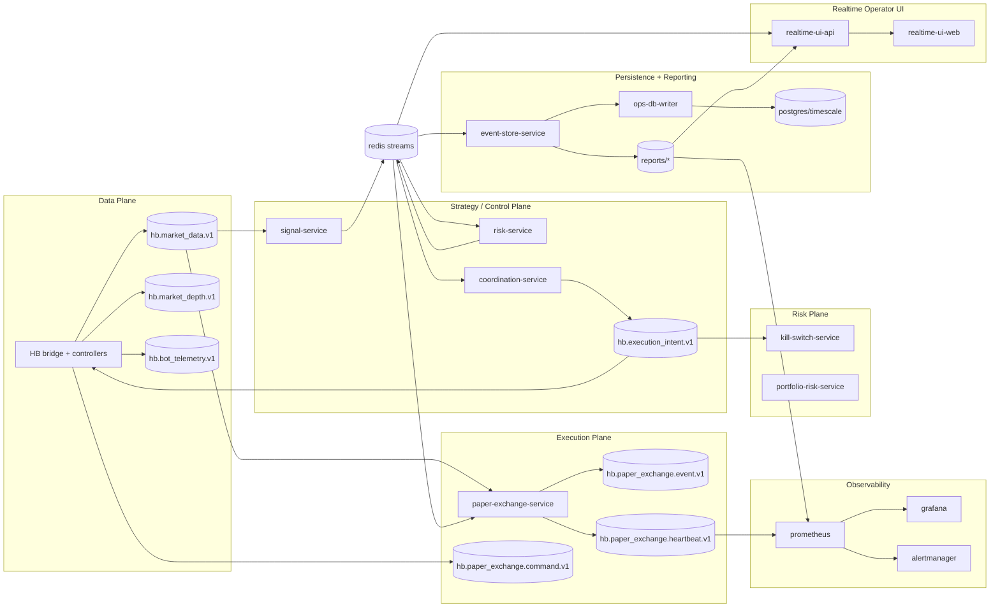

# System Architecture

## Purpose
Define the canonical runtime architecture for the EPP v2.4 desk across data,
strategy/control, execution, risk, persistence, and observability planes.

## Scope
Containerized production topology (`compose/docker-compose.yml`) and stream-based
service contracts (`services/contracts/*`).

## Domain Boundaries
- **Data plane**: market snapshots and telemetry events.
- **Strategy/control plane**: signal/risk/coordination decisions and intent routing.
- **Execution plane**: paper exchange service command/event lifecycle.
- **Risk planes**:
  - bot-level guardrails (`ops_guard`, kill-switch path),
  - portfolio-level controls (`portfolio-risk-service`, policy gates).
- **Persistence/observability plane**: event store, ops DB writer, release artifacts, dashboards, alerts.

## Strategy Isolation
- Shared runtime modules must remain strategy-agnostic and must not import lane modules.
- Bot-specific strategy logic must be isolated under `controllers/bots/`.
- `controllers/market_making/` is reserved for market-making loader shims only.
- Legacy `epp_v2_4_bot*` files are compatibility wrappers only.
- See `docs/architecture/strategy_isolation_contract.md` for dependency rules and verification commands.

## Runtime Diagram

```mermaid
flowchart LR
  subgraph DataPlane[Data Plane]
    hb[HB bridge + controllers]
    md[(hb.market_data.v1)]
    depth[(hb.market_depth.v1)]
    bt[(hb.bot_telemetry.v1)]
  end

  subgraph ControlPlane[Strategy / Control Plane]
    sig[signal-service]
    risk[risk-service]
    coord[coordination-service]
    intent[(hb.execution_intent.v1)]
  end

  subgraph ExecPlane[Execution Plane]
    pe[paper-exchange-service]
    pec[(hb.paper_exchange.command.v1)]
    pee[(hb.paper_exchange.event.v1)]
    peh[(hb.paper_exchange.heartbeat.v1)]
  end

  subgraph RiskPlane[Risk Plane]
    ks[kill-switch-service]
    pr[portfolio-risk-service]
  end

  subgraph Persistence[Persistence + Reporting]
    es[event-store-service]
    dbw[ops-db-writer]
    pg[(postgres/timescale)]
    rep[(reports/*)]
  end

  subgraph Observability[Observability]
    prom[prometheus]
    graf[grafana]
    am[alertmanager]
  end

  subgraph RealtimeUi[Realtime Operator UI]
    rapi[realtime-ui-api]
    rweb[realtime-ui-web]
  end

  redis[(redis streams)]

  hb --> md
  hb --> depth
  hb --> bt
  md --> sig --> redis
  redis --> risk --> redis
  redis --> coord --> intent
  intent --> hb
  intent --> ks

  hb --> pec
  md --> pe
  redis --> pe
  pe --> pee
  pe --> peh

  redis --> es
  redis --> rapi
  es --> rep
  es --> dbw --> pg
  rep --> rapi
  rapi --> rweb

  rep --> prom --> graf
  prom --> am
  peh --> prom
```

## Source Of Truth By Plane
- **Order lifecycle (paper mode)**: `paper-exchange-service` state + journals.
- **Trading decisions**: controller + risk/coordination intent chain.
- **Event history**: `event-store-service` artifacts, mirrored to DB when enabled.
- **Realtime operator view**: `realtime-ui-api` stream-first read model with desk-snapshot fallback.
- **Promotion go/no-go**: `scripts/release/run_promotion_gates.py` + `run_strict_promotion_cycle.py`.

## Failure Containment Policies
- Redis degradation must not crash controller ticks; bot remains in local safe mode.
- Missing/stale paper-exchange heartbeat is treated as critical once paper-exchange gates are enabled.
- Command processing is at-least-once; correctness relies on idempotency + pending reclaim.
- Promotion gates are fail-closed for critical checks (thresholds, preflight, canonical-plane guards).

## References
- `docs/techspec/service_interfaces.md`
- `docs/architecture/data_flow_signal_risk_execution.md`
- `docs/architecture/strategy_isolation_contract.md`
- `services/contracts/stream_names.py`
- `services/contracts/event_schemas.py`
- `compose/docker-compose.yml`

## Owner
- Architecture/Platform
- Last-updated: 2026-03-03

