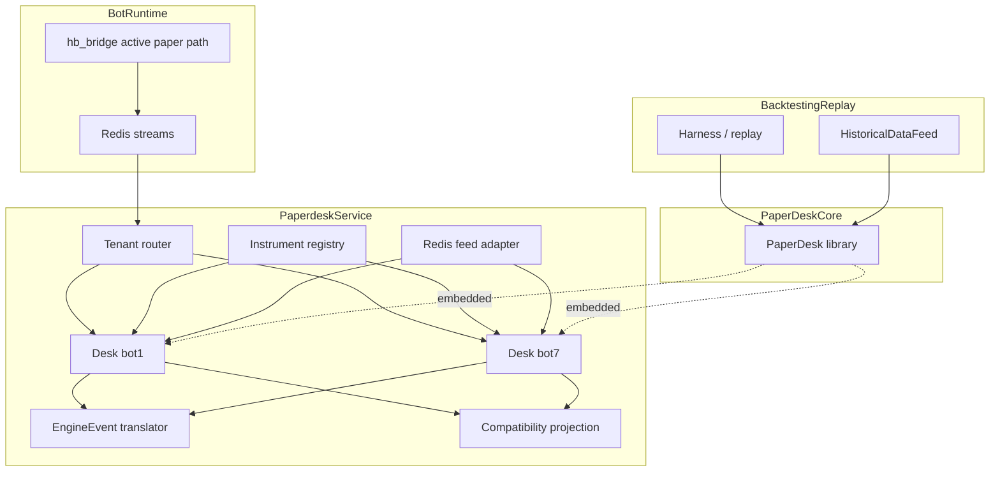

## Context

`PaperDesk` is already the most complete paper-exchange engine in the repo. It has:

- `Decimal`-based accounting
- depth-aware fill models
- latency models
- funding simulation
- post-trade risk evaluation
- a clean embedded API used by backtesting and replay

The current service implementation in `hbot/services/paper_exchange_service/main.py` duplicates those responsibilities with a separate codebase and separate bugs.

However, a direct "one global service-wide PaperDesk" is also wrong. `PaperDesk` is designed as a shared portfolio within one process; if used naïvely inside the service, different bots would share balances and risk state. The current paper-exchange contract is tenant-scoped by `instance_name`, so the service wrapper must preserve that isolation.

## Goals / Non-Goals

**Goals**

- Make `PaperDesk` the only exchange simulation engine used by both service mode and embedded mode.
- Preserve current Redis stream and snapshot contracts so dashboards, promotion gates, ops writers, and the HB bridge do not need a parallel migration.
- Preserve bot-level isolation in service mode.
- Preserve embedded backtesting/replay with direct synchronous Python calls.
- Remove duplicated accounting/matching/funding logic from the service layer.

**Non-Goals**

- Rewriting backtesting to use Redis.
- Renaming paper connectors or changing bot configs to `paper_*` aliases.
- Replacing all snapshot consumers with new readers during this change.
- Deleting the `paper_engine_v2/` library; it remains the core engine.

## Decisions

### 1. One engine, two modes

**Decision**: `PaperDesk` remains a library and becomes the only simulation engine. Service mode wraps it; embedded mode imports it directly.

**Why**: This removes the highest-risk duplication without sacrificing replay/backtesting ergonomics.

### 2. Service router owns one desk per `instance_name`

**Decision**: The service wrapper keeps a registry like `instance_name -> TenantDeskRuntime`, where each tenant runtime owns its own `PaperDesk`, feed state, open-order projection state, and persistence/projection outputs.

**Why**: A single `PaperDesk` would share balances and risk across bots, violating the current service contract.

### 3. Compatibility projection is a first-class component

**Decision**: Do not treat `DeskStateStore` as the external snapshot contract. Add an explicit projection layer that derives:

- `paper_exchange_state_snapshot_latest.json`
- `paper_exchange_pair_snapshot_latest.json`
- command/fill journals as needed

from the tenant desks and in-memory service state.

**Why**: `DeskStateStore` does not persist open orders, while existing consumers depend on `orders` in the state snapshot.

### 4. Service translates `EngineEvent`s directly

**Decision**: The service owns a generic translator from `PaperDesk` `EngineEvent`s to:

- `PaperExchangeEvent`
- heartbeat metadata
- privileged audit events
- snapshot/journal projection updates

**Why**: The existing `EventSubscriber` abstraction lives in the HB bridge layer, not in `PaperDesk` itself.

### 5. Instrument registration must be explicit

**Decision**: Add an instrument registry/bootstrap layer that resolves `InstrumentSpec` before order acceptance, using:

- command metadata already attached by `hb_bridge.py`
- trading rule hints where available
- deterministic defaults for venue/instrument type/margin settings

**Why**: The service wrapper must not reject valid commands due to missing `register_instrument()` calls.

### 6. Keep runtime paper/live switching unchanged

**Decision**: Preserve:

- existing connector names
- `BOT_MODE=paper|live`
- current command/event/heartbeat stream names

**Why**: The architecture change should be internal. Strategies and bot configs should not care whether paper execution is in-process or service-backed.

## Target Architecture

## Risks / Trade-offs

- **Tenant runtime complexity increases**: one service process now manages multiple desks instead of one global state object.  
  **Mitigation**: make tenant runtime an explicit object with isolated feed, desk, projection, and counters.

- **Compatibility projection may become the new hidden duplication point**.  
  **Mitigation**: projection is read-model only. It must not recompute positions/PnL; it only exposes already-produced engine state plus service-owned open-order metadata.

- **Instrument bootstrap can fail on incomplete metadata**.  
  **Mitigation**: make failures explicit and reject with deterministic `instrument_spec_unavailable` reasons instead of silent fallbacks.

- **Bridge migration can break active-mode behavior**.  
  **Mitigation**: shadow-run the new service, compare outputs, and keep rollback to the legacy service until parity is proven.
